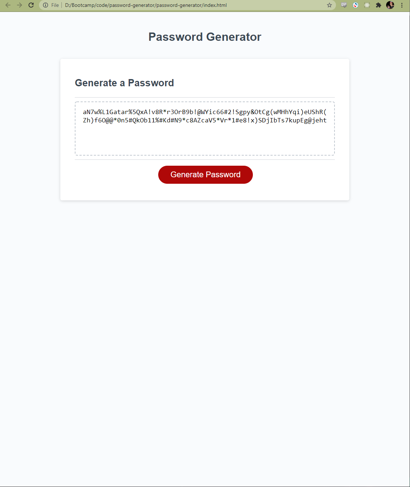

# 03 JavaScript: Password Generator - Jared Hector

https://jwhector.github.io/password-generator/

The task for this project was to create a web application that  generates a random password after asking for:

    * The password length, limited between 8 and 128.
    * Whether the password should contain lower case letters.
    * Whether the password should contain upper case letters.
    * Whether the password should contain numbers.
    * Whether the password should contain special characters.

The application will display the generated password after these prompts, ensuring at least one of each of the desired characters appear in the prompt.

Hurdles encountered during the development of this project related mainly to organization as well as identification and removal of redundant code. After a few iterations I am happy with the conciseness and effectiveness of my code.
